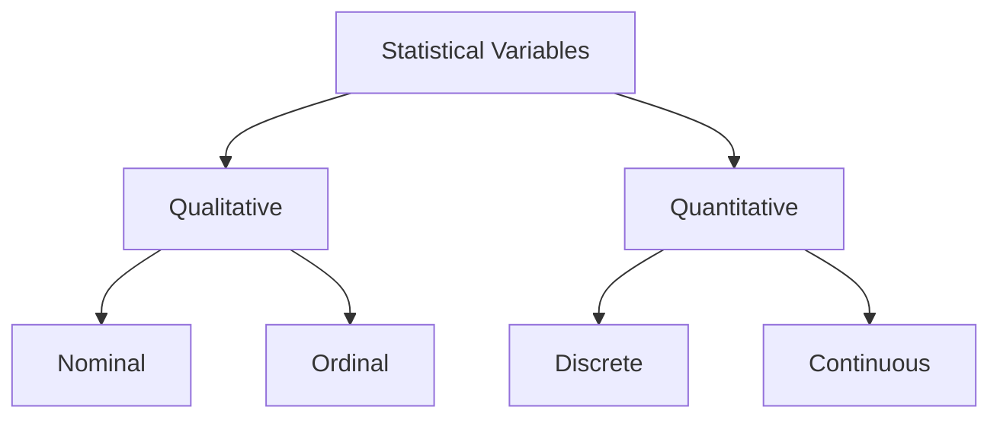

## Descriptive Statistics

### Variables

#### Concepts

- **Qualitative (Categorical)** variables are non-numeric and describe categories.
  - **Nominal**: No inherent order (e.g., colors, gender, nationality).
  - **Ordinal**: Ordered categories (e.g., satisfaction levels, rankings).
- **Quantitative (Numerical)** variables are numeric and measurable.
  - **Discrete**: Integer values (e.g., number of students, dice roll outcomes).
  - **Continuous**: Values within a range (e.g., height, weight, temperature).

### Central Limit Theorem (CLT)

The Central Limit Theorem (CLT) states that the sampling distribution of the sample mean (or sum) of a large enough sample from any population (with finite variance) approaches a normal distribution (bell-shaped curve), regardless of the original population's distribution.
